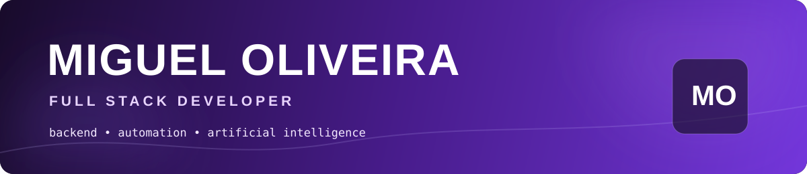

<div align="center">

<br/><br/>
<a href="https://curriculo-ten-hazel.vercel.app/"></a>
<a href="https://www.linkedin.com/in/miguel-o-07203b3b1"></a>
<a href="mailto:oliveiramiguel1003@gmail.com"></a>
<br/><br/>

</div>

## `$ whoami`

```ts
const miguel = {
  role: "Full Stack Developer",
  education: "Análise e Desenvolvimento de Sistemas",
  base: "Taubaté · São Paulo · Brazil",

  engineering: ["Backend", "Web", "APIs", "Data"],
  exploring: ["Artificial Intelligence", "Automation", "Cloud"],
  principle: "technology is useful when it solves a real problem",

  currentlyBuilding: ["PersonalHub", "GSPlan", "Vyzor"],
  next: "deeper backend, system design and intelligent products"
};
```

Eu gosto da parte da tecnologia em que uma ideia deixa de ser conceito e **vira algo que funciona**. Meu foco está em construir aplicações completas, integrar serviços, automatizar processos e usar IA como ferramenta prática — não como enfeite.

---

## `01 / engineering toolkit`

<div align="center">

<br/><br/>


</div>

---

## `02 / things I've built`

<table>
<tr>
<td width="50%" valign="top">
<h3>◢ PersonalHub</h3>
<b>Your life, one system.</b><br/><br/>
Um ecossistema pessoal que reúne finanças, estudos, tarefas e IA. Representa minha visão de produto: reduzir fragmentação e transformar várias ferramentas em uma experiência única.<br/><br/>
<code>Product</code> <code>Web</code> <code>AI</code> <code>Automation</code><br/><br/>
<a href="https://www.personalhub.sbs/"></a>
</td>
<td width="50%" valign="top">
<h3>◢ GSPlan</h3>
<b>Technology for wealth management.</b><br/><br/>
Plataforma voltada à gestão patrimonial, combinando organização, dados e uma experiência construída para transformar informações financeiras em acompanhamento útil.<br/><br/>
<code>Fintech</code> <code>Data</code> <code>Management</code> <code>Web</code><br/><br/>
<a href="https://www.gsplan.company/"></a>
</td>
</tr>
<tr>
<td width="50%" valign="top">
<h3>◢ Vyzor</h3>
<b>Information without the friction.</b><br/><br/>
Projeto de automação e centralização de dados empresariais, explorando IA para acelerar o acesso à informação e reduzir trabalho manual.<br/><br/>
<code>Python</code> <code>AI</code> <code>Data</code> <code>Automation</code><br/><br/>
<a href="https://github.com/miguelsenai2024/Vyzor"></a>
</td>
<td width="50%" valign="top">
<h3>◢ AI Sales Mini App</h3>
<b>Automation inside the conversation.</b><br/><br/>
Mini App para Telegram com n8n, Supabase e Gemini/Groq: validação, captura de leads e fluxos inteligentes de venda integrados ao bot.<br/><br/>
<code>n8n</code> <code>Supabase</code> <code>Gemini</code> <code>Groq</code><br/><br/>
<a href="https://github.com/miguelsenai2024/telegram-miniapp-vendas-ia"></a> <a href="https://t.me/theworkshop2026_bot"></a>
</td>
</tr>
</table>

<details>
<summary><b>↳ more projects</b></summary>
<br/>

**ScopeMaster** — gerenciamento de requisitos, propostas e escopo. [Abrir ↗](https://scope-master-alpha.vercel.app/)

**ReAlimenta** — tecnologia aplicada ao combate ao desperdício alimentar. [Código ↗](https://github.com/Miguelsenai2024/ReAlimenta-Public)
</details>

---

## `03 / beyond the code`

<table>
<tr>
<td width="33%" align="center"><b>AI</b><br/><sub>IA aplicada a problemas reais e automações</sub></td>
<td width="33%" align="center"><b>Cloud</b><br/><sub>AWS Cloud Foundations e infraestrutura</sub></td>
<td width="33%" align="center"><b>Data</b><br/><sub>Análise, SQL e sistemas orientados a dados</sub></td>
</tr>
<tr>
<td width="33%" align="center"><b>Linux</b><br/><sub>Ambiente de desenvolvimento e fundamentos</sub></td>
<td width="33%" align="center"><b>Product</b><br/><sub>Construção pensando além do código</sub></td>
<td width="33%" align="center"><b>Learning</b><br/><sub>Experimentar → construir → entender</sub></td>
</tr>
</table>

---

## `04 / github signal`

<div align="center">


<br/>

</div>

<details>
<summary><b>↳ contribution lab</b></summary>
<br/>
<div align="center">

<br/><br/>

</div>
</details>

---

## `05 / let's build something`

<div align="center">
<b>Produtos. Backend. IA. Automações. Ideias que precisam virar software.</b>
<br/><br/>
<a href="mailto:oliveiramiguel1003@gmail.com"></a>
<a href="https://www.linkedin.com/in/miguel-o-07203b3b1"></a>
<a href="https://curriculo-ten-hazel.vercel.app/"></a>
<br/><br/>
<a href="https://www.instagram.com/miguel_oliveira_dev">Instagram</a> · <a href="https://wa.me/5512988327726">WhatsApp</a>
<br/><br/>

<br/><br/>
<sub>Not a collection of technologies. A record of things I'm learning to build.</sub>
</div>